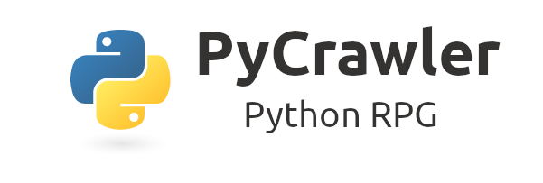

## PyCrawler

  This is the repository of my first Python project: PyCrawler. It is a simple terminal-based RPG modeled around a roguelike playstyle.

  ## Roadmap:
    [✓] Add the actual game play loop with functioning enemy spawn
    [ ] Add some sort of loot system with basic upgrades
    [ ] More advanced stats like speed
    [ ] Functionality for battles with multiple enemies
    [ ] A system for attack types and the introduction of resistance and weakness to different attack types
    [ ] Maybe make a better logo 
  
  ## Credits
    The art would not have been possible without the amazing [px2ansi](https://github.com/Nellousan/px2ansi/tree/main) tool by Nellousan